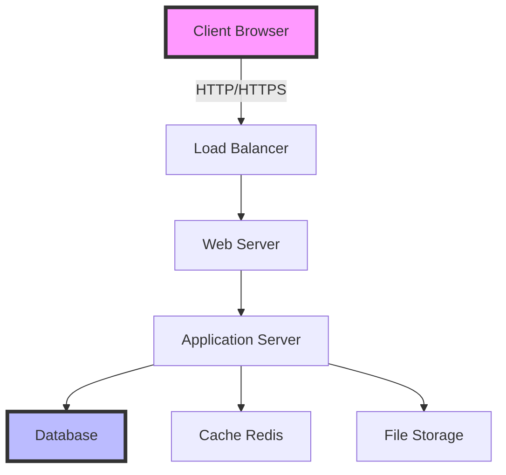
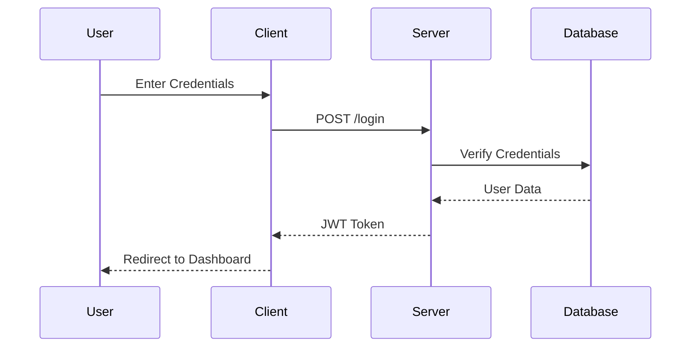
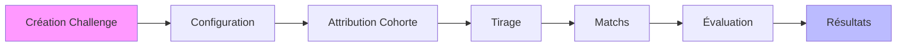
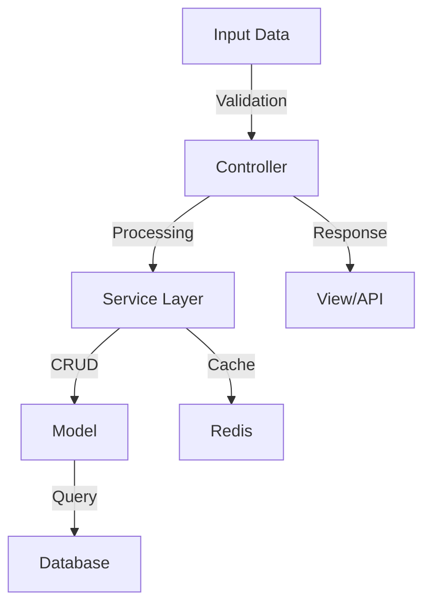
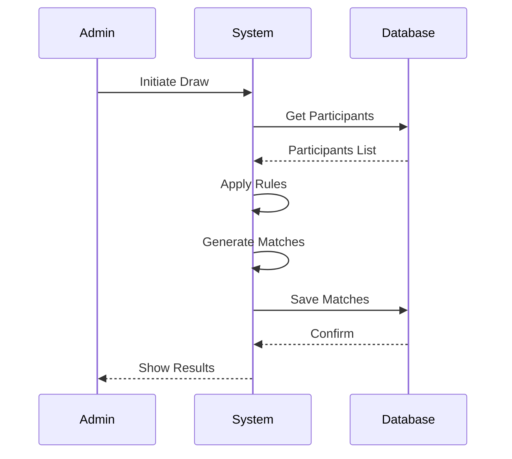
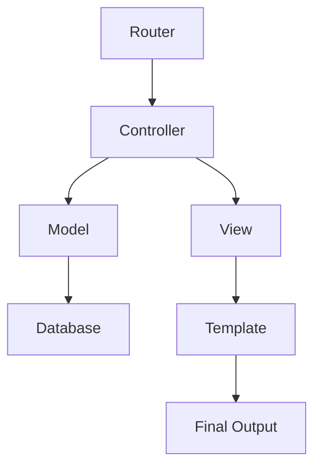
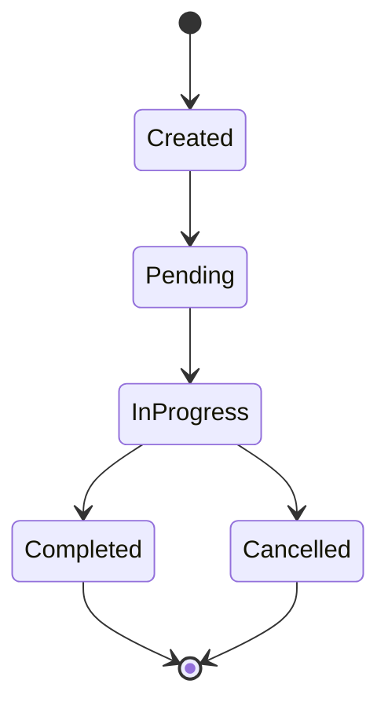
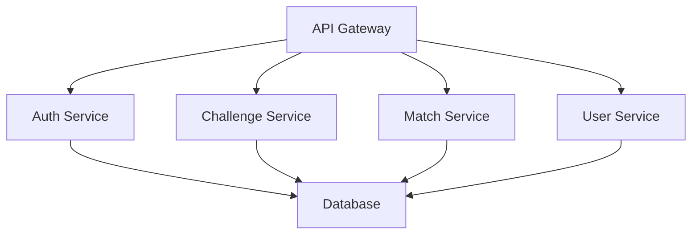

# Diagrammes de Flux et Architecture

## 1. Architecture Système

## 2. Flux d'Authentification

## 3. Processus de Challenge

## 4. Flux de Données

## 5. Processus de Tirage

## 6. Structure MVC

## 7. Cycle de Vie d'un Match

## 8. Architecture des Services

## Notes sur les Diagrammes

1. Les diagrammes sont créés avec Mermaid.js
2. Ils peuvent être visualisés avec un éditeur Markdown compatible
3. Les couleurs indiquent l'importance des composants
4. Les flèches montrent le flux de données/processus
